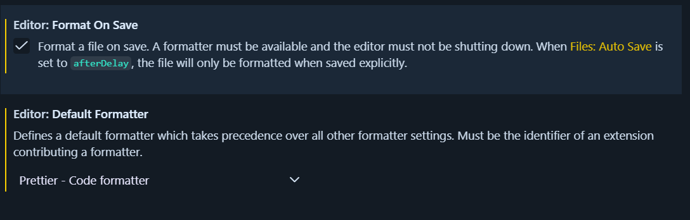
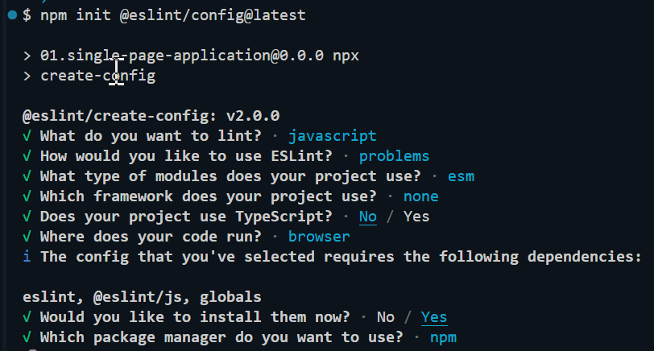

# Instalando y trabajando con .editorconfig, prettier y jslint

# EditorConfig

- Define reglas básicas y universales del archivo
  - Identación
  - Charset
  - Fin de línea

No hace: Es formaterar código.

# Prettier

- Formatea el código automaticamente
  - saltos de línea
  - comillas
  - espacios
  - ancho de línea

No hace: control de lógica, solo como se ve.

# JSLint -> antigua - ESLint

- Detectecta errores
  - Variables no declaradas
  - Variables que nunca se usan
  - Código inalcanzable
  - comparaciones mal hechas
  - Promesas sin await
  - try/catch inútiles

No hace: estilo, como se ve.

# Resumen

- .editorconfig -> convenciones del proyecto (Editor)
- ESLint -> errores + calidad
- Prettier -> solo formato

# Instalaciones

- .editorconfig -> EditorConfig.EditorConfig
- ESLint -> dbaeumer.vscode-eslint
- Prettier -> esbenp.prettier-vscode

## Configuración Editor Config

<https://editorconfig.org/>

> .editorconfig

```ini
root = true

[*]
charset = utf-8
end_of_line = lf
insert_final_newline = true
indent_style = space
indent_size = 2
```

# Instalar dependencias con NPM

```sh
npm install -D eslint prettier eslint-config-prettier eslint-plugin-prettier
```

# Configuración de Prettier

<https://prettier.io/>

> .prettierrc.json

```json
{
  "semi": true,
  "singleQuote": true,
  "printWidth": 80,
  "tabWidth": 2,
  "trailingComma": "es5"
}
```

## Configuración del VSC para usar prettier

> Engranaje -> Settings (Configuración)



# Configuración de ESLint

<https://eslint.org/>

```sh
npm init @eslint/config@latest
```



- usernamehw.errorlens
- dbaeumer.vscode-eslint

> New Config

```js
import js from '@eslint/js';
import prettier from 'eslint-config-prettier';
import prettierPlugin from 'eslint-plugin-prettier';

export default [
  js.configs.recommended,
  {
    languageOptions: {
      globals: {
        console: 'readonly',
        process: 'readonly',
      },
    },
    plugins: {
      prettier: prettierPlugin,
    },
    rules: {
      ...prettier.rules,

      // calidad
      'no-unused-vars': 'warn',
      eqeqeq: 'error',

      // buenas prácticas
      'prefer-const': 'error',
      'no-var': 'error',

      // prettier como fuente única de formato
      'prettier/prettier': 'error',
    },
  },
];
```

> Default

```js
import js from '@eslint/js';
import globals from 'globals';
import { defineConfig } from 'eslint/config';

export default defineConfig([
  {
    files: ['**/*.{js,mjs,cjs}'],
    plugins: { js },
    extends: ['js/recommended'],
    languageOptions: { globals: globals.browser },
  },
]);
```

# Configuración del archivo settings.json en VSC

```json
{
  "editor.formatOnSave": true,
  "editor.defaultFormatter": "esbenp.prettier-vscode",
  "editor.codeActionsOnSave": {
    "source.fixAll.eslint": "always"
  }
}
```
